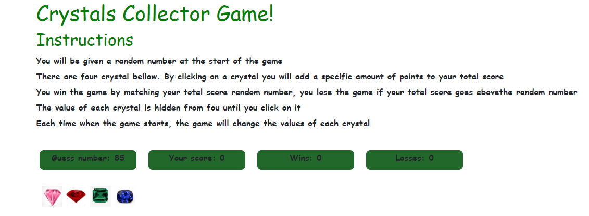

# Crystal Collectors
Game randomizes the crystal values and allows the user to try to match the number given

#  How use it
You will be given a random number at the start of the game
There are four crystal bellow. By clicking on a crystal you will add a specific amount of points to your total score
You win the game by matching your total score random number, you lose the game if your total score goes abovethe random number
The value of each crystal is hidden from fou until you click on it
Each time when the game starts, the game will change the values of each crystal

# Technologies used

HTML

CSS

BOOTSTRAP

JAVASCRIPT

JQUERY

# Demo link
https://idalmys.github.io/unit-4-game/
